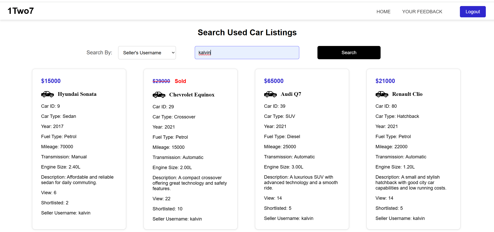

<div>
  <h1>Used Car Website</h1>
</div>

<br>

## Description
This is a used car web application developed as part of the CSIT314 Software Development Methodologies module. Built using Python (Flask), HTML, CSS, JavaScript, MySQL, and the BCE framework, the system provides an easy-to-use interface for agents, buyers, sellers, and administrators to manage used car listings. Key features include secure login, listing management, search and shortlist, loan calculation, and agent reviews. 

<br>

## Setup Instructions

### Window

```bash
# Create a virtual environment
python -m venv venv

# Activate the virtual environment
.\venv\Scripts\activate

# Install required packages
pip install -r requirements.txt
```

### Running the Application

```bash
# After activating the virtual environment and installing the dependencies, run:
python app.py
```

<br>

## Login Page
<div align="center">
  
</div>
<br>

## Signup Page
<div align="center">
  
</div>
<br>

## Reset Password Page
<div align="center">
  
</div>
<br>

### Homepage
<div align="center">
  
</div>
<br>

### Create Car Listing
<div align="center">
  
</div>
<br>

### View Car Listing
<div align="center">
  
</div>
<br>

### Search Car Listing
<div align="center">
  
</div>
<br>

### Feedback
<div align="center">
  
</div>
<br>

### Calculator
<div align="center">
  
</div>
<br>

